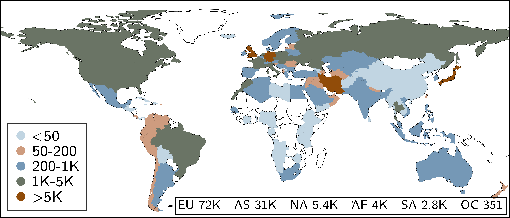
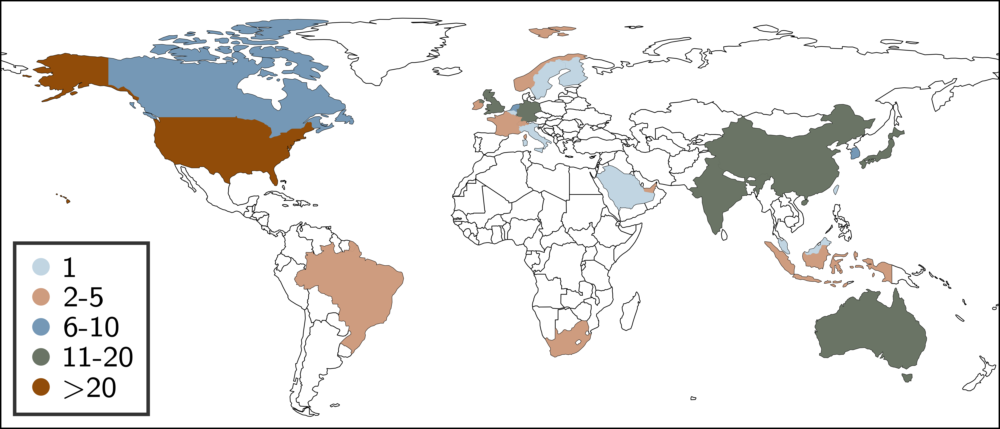

# Cloudy with a Chance of Short RTTs: Analyzing Cloud Connectivity in the Internet

The Khang Dang<sup>1</sup>, Nitinder Mohan<sup>1</sup>, Lorenzo Corneo<sup>2</sup>, 
Aleksandr Zavodovski<sup>2</sup>, Jörg Ott<sup>1</sup>, Jussi Kangasharju<sup>3</sup>

<sup>1</sup>Technical University of Munich, <sup>2</sup>Uppsala University, <sup>3</sup>University of Helsinki

---

This repository contains the code to reproduce the results and figures of our publication *Cloudy with a Chance of 
Short RTTs: Analyzing Cloud Connectivity in the Internet* accepted for [**ACM Internet Measurement Conference (IMC) 2021**](https://conferences.sigcomm.org/imc/2021/).

To better structure this, all of the code is included in the `speedchecker-analysis.ipynb` file in form of a Jupyter notebook.
We split all of the figures into different cells with headers which provide information about the number of the
figure in the paper as well as a short description of the content.

Also included are two .json-files which are used to convert country codes in the case of `iso3.json` 
(obtained from [here](http://country.io/iso3.json) and to look up additional information and enrich
the present data in the case of `peeringdb.json` (obtained from [PeeringDB](https://peeringdb.com/api/net)).

---

# Vantage points

Throughout our measurements we used over 115,000 Speedchecker probes. This is their distribution across different
countries.



---

# Cloud datacenters

We targeted virtual machines hosted in 195 datacenters in many different countries throughout the world.


---

# Dataset

The data necessary for the plots needs to be downloaded before starting and
is available at [mediaTUM](https://mediatum.ub.tum.de/1624200) with instructions on how to set it up. 
We encourage to cite our IMC 2021 paper in your academic publications upon usage.

```
@inproceedings{cloudyIMC2021,
	author= {Dang, The Khang and Mohan, Nitinder and Corneo, Lorenzo and Zavodovski, Aleksandr and Ott, Jörg and Kangasharju, Jussi},
	title={{Cloudy with a Chance of Short RTTs: Analyzing Cloud Connectivity in the Internet}},
	booktitle = {Proceedings of Internet Measurement Conference},
	publisher = {Association for Computing Machinery},
	address = {New York, NY, USA},
	url = {https://doi.org/10.1145/3487552.3487854},
	doi = {10.1145/3487552.3487854},
	year={2021},
	series = {IMC '21}
}
```

Additionally, the dataset from an [earlier publication](https://github.com/lorenzocorneo/surrounded-by-the-clouds) is necessary for certain
figures as well. This dataset is also available at [mediaTUM](https://mediatum.ub.tum.de/1593899).

---

# Usage instructions

## Step 0: Install datasets

Most likely you have already completed this step. 
The reproduction is dependent on two databases. 

1. Speedchecker platform dataset: You can download it from [here](https://mediatum.ub.tum.de/1624200).
2. RIPE Atlas platform dataset: You can download it from [here](https://mediatum.ub.tum.de/1593899).

## Step 1: Install Python and its dependencies

In order to run the analysis you need to set up a working Jupyter Lab environment with Pythonv3. In addition, several non-default Python libraries were used. 

If you want to use a Python virtualenv, you can create one with:

```shell
python3 -m venv MY-VENV-LOCATION
```

Then you can activate the virtualenv with:

```shell
source MY-VENV-LOCATION/bin/activate
```

The libraries can then be installed with the following command:

```
pip install -r requirements.txt
```

Note that some of the libraries/dependencies (GDAL, Fiona, Cartopy, basemap) might need to be installed manually through wheel files
which are available [here](https://www.lfd.uci.edu/~gohlke/pythonlibs/) for Windows for example. These need to be downloaded 
and can then be installed with:

```
pip install <path/to/wheel/file>
```

It might also be necessary to update pip in order to install all of the libraries. This can be done with:

```
pip install --upgrade pip
```

## Step 2: Start Jupyter Lab

Before you start Jupyter Lab, make sure that your Python virtualenv (if you are using one), is activated:

```shell
source MY-VENV-LOCATION/bin/activate
```

Then simply start the Jupyter Lab server in the current directory:

```shell
jupyter-lab
```

This should open a browser if run on a GUI system or display information about the used port and configuration when run on a headless server, which can be used when establishing an SSH tunnel.


## Step 3: Run analysis in Jupyter Lab

You can now run the reproduction step by step in the Jupyter Lab's browser window by running `speedchecker-analysis.ipynb`.
The resulting figures will then be placed in the `Figs/` folder and will be named after the figure identifier used in the paper.
